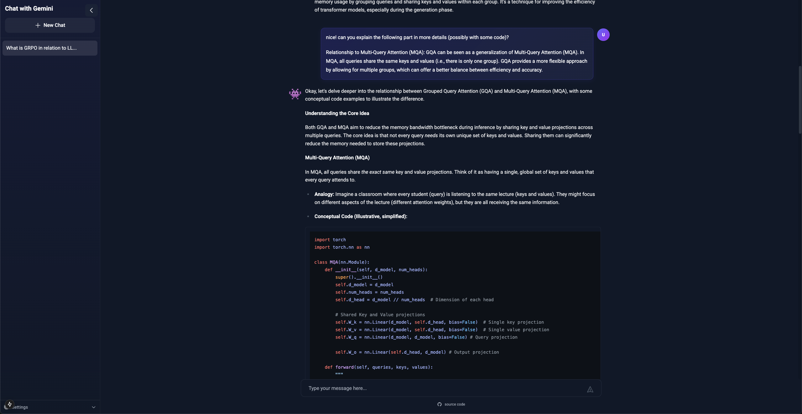

# Chat with Gemini

A full-stack chat application built with Next.js, FastAPI, and Google's Gemini 2.5 Pro Experimental model. Features a modern UI, conversation history, and customizable AI settings.



I just thought I wanted to try this since the Gemini API is free. Works pretty well.

## Table of Contents
1. [Features](#features)
2. [Prerequisites](#prerequisites)
3. [Project Structure](#project-structure)
4. [Installation](#installation)
5. [Configuration](#configuration)
6. [AI Settings](#ai-settings)
7. [Development](#development)
8. [Streamlit App](#streamlit-app)
9. [Conversation Data Storage](#conversation-data-storage)
10. [License](#license)

#

## Features <a name="features"></a>

- 💬 Real-time streaming chat responses
- 🔄 Persistent conversation history
- ⚙️ Customizable AI parameters
- 📱 Responsive design
- 🎨 Modern UI with dark mode
- 🔧 Advanced settings for fine-tuning responses
- 🚀 Powered by Gemini 2.5 Pro Experimental with 64K token context window

---

## Prerequisites <a name="prerequisites"></a>

- Node.js (v18 or higher)
- Python (v3.8 or higher)
- Google Gemini API key ([Get one here](https://ai.google.dev/gemini-api/docs/api-key))

---

## Project Structure <a name="project-structure"></a>

```bash
chat-app/
├── app/ # Next.js frontend
├── backend/ # FastAPI backend
├── streamlit/ # Streamlit app
├── public/ # Static files
├── install.sh # Installation script for macOS/Linux
├── run.sh # Run script for macOS/Linux
├── install.bat # Installation script for Windows
├── run.bat # Run script for Windows
└── README.md
```

---

## Installation <a name="installation"></a>

There are two ways to install this application:

1. Through the installation script
2. The OCD way, where you set up everything manually

### 1. Installation through the installation script

#### For macOS/Linux:

1. Clone the repository:

```bash
git clone https://github.com/sumitdotml/chat-with-gemini.git
cd chat-with-gemini
```

2. Run the installation script:
   ```bash
   chmod +x install.sh
   ./install.sh
   ```

During the installation, you will be prompted to enter your Gemini API key.

3. Start the application:
   ```bash
   chmod +x run.sh
   ./run.sh
   ```

#### For Windows:

1. Clone the repository:
   ```bash
   git clone https://github.com/sumitdotml/chat-with-gemini.git
   cd chat-with-gemini
   ```   
2. Run the installation script:
   ```bash
   install.bat
   ```
3. Start the application:
   ```bash
   run.bat
   ```

The installation script will:
- Install frontend dependencies
- Set up the Python virtual environment
- Install backend dependencies

The run script will:
- Start the backend server on http://localhost:8000
- Start the frontend on http://localhost:3000

You can also run just the backend or frontend:
```bash
# macOS/Linux
./run.sh backend
./run.sh frontend

# Windows
run.bat backend
run.bat frontend
```

---

### 2. Manual Setup Instructions

If you have extreme OCD like me and prefer to set up manually so that you feel like you have control over your life, follow these steps:

#### 1. Backend Setup

```bash
cd backend
```

Create and activate virtual environment

```bash
python -m venv .venv
source .venv/bin/activate # On Windows: .venv\Scripts\activate

# or if you're using uv for dependency management (recommended)
uv venv
source .venv/bin/activate # On Windows: .venv\Scripts\activate
```

Install dependencies

```bash
pip install -r requirements.txt

# or if you're using uv for dependency management (recommended)
uv pip install -r requirements.txt
```

Create .env file (this ought to be in the root directory of the backend folder)

```bash
echo "GEMINI_API_KEY=your_api_key_here" > .env
```

#

#### 2. Frontend Setup

```bash
# In the root directory
npm install
```

#

#### 3. Running the Application

1. Start the backend server from the backend folder:

```bash
cd backend
uvicorn main:app --reload
```

2. In a new terminal, start the frontend (this should be in the root directory of our project)

```bash
npm run dev
```

3. Open [http://localhost:3000](http://localhost:3000) in your browser

---

## Configuration <a name="configuration"></a>

### Environment Variables

Backend (`.env`):

```bash
GEMINI_API_KEY=your_api_key_here
```

#

### AI Settings <a name="ai-settings"></a>

The application uses Google's Gemini 2.5 Pro Experimental model with the following features:

- **Model**: Gemini 2.5 Pro Experimental
- **Max Output Tokens**: 64,000 (increased from 8,192 in previous versions)
- **Temperature**: Adjustable (0.0 - 1.0)
- **System Message**: Customizable

You can adjust these settings in the application's settings panel.

---

## Development <a name="development"></a>

### Frontend (Next.js)

The frontend is built with Next.js and includes:

- Real-time message streaming
- Conversation history management
- Responsive design
- Dark mode
- Customizable AI settings

### Backend (FastAPI)

The backend is built with FastAPI and handles:

- Gemini API integration
- Message streaming
- Conversation management
- Error handling

## Streamlit App

If you want to try the Gemini API without all the frontend and backend stuff (just want to test it out quickly), you can use the streamlit app in the [streamlit](./streamlit/) directory.

The setup instructions are in the [README.md](./streamlit/README.md) file of the streamlit directory. Very simple.

---

## Conversation Data Storage <a name="conversation-data-storage"></a>

Conversations are stored locally in the browser's localStorage. This means:

- Conversations persist between sessions
- Data is stored locally on your device
- No server-side storage required
- Easy to clear or export

---

## License <a name="license"></a>

[MIT](LICENSE.txt)
